# Enterprise Legal AI Agent

## 企业法务 AI 合同审查工作台 MVP

Enterprise Legal AI Agent 是一个面向企业法务场景的 AI 合同审查工作台 MVP，演示如何通过 **Agent + RAG + Workflow + Human-in-the-loop** 实现合同风险识别、法规依据检索、风险分流、人工复核与审计留痕。

> 免责声明：本项目是 AI Solution / Vibe Coding 作品集 MVP，不构成正式法律意见，不用于替代律师或企业法务的专业判断。

## Demo Screenshots

> 将截图放入 `docs/images/` 后，GitHub 会自动显示。截图命名说明见 [`docs/images/README.md`](docs/images/README.md)。

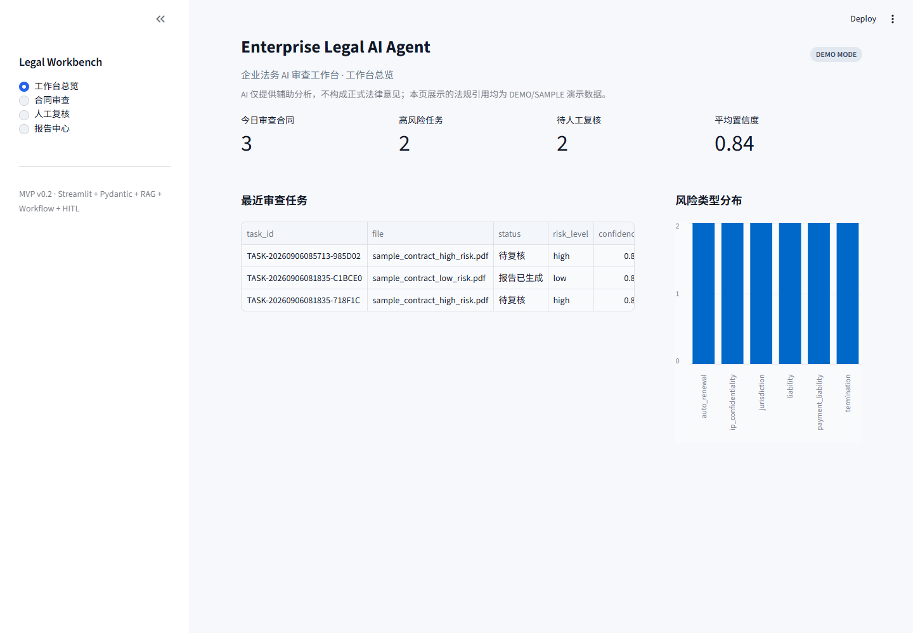
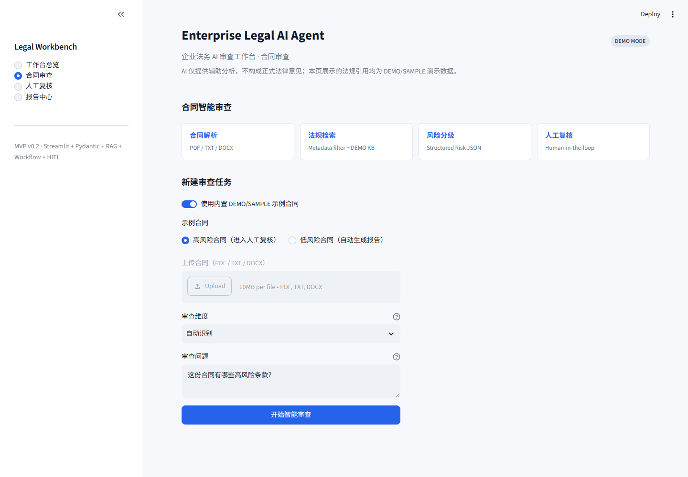
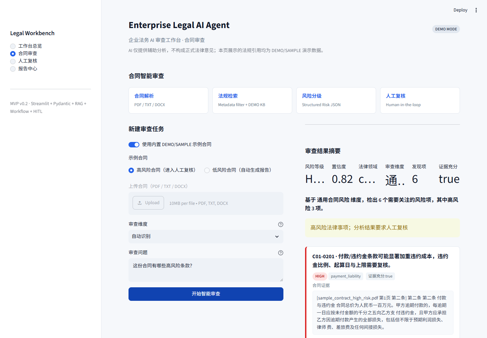
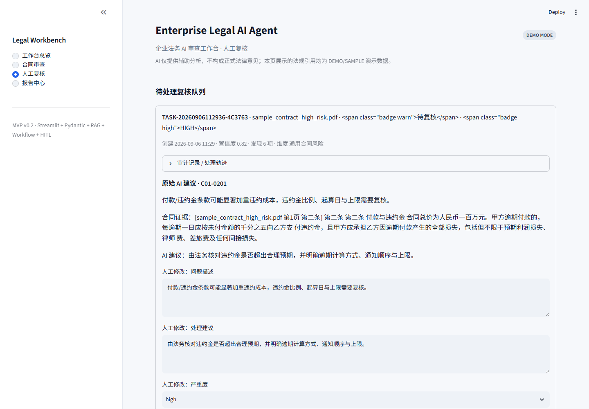
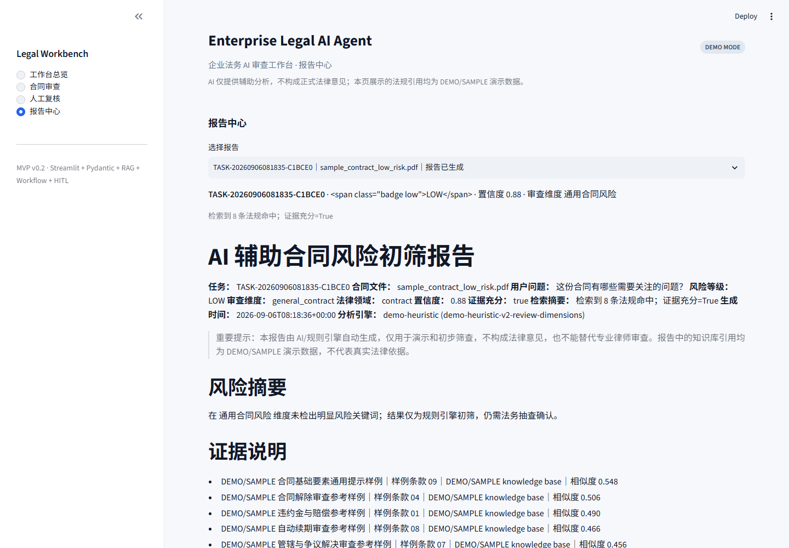
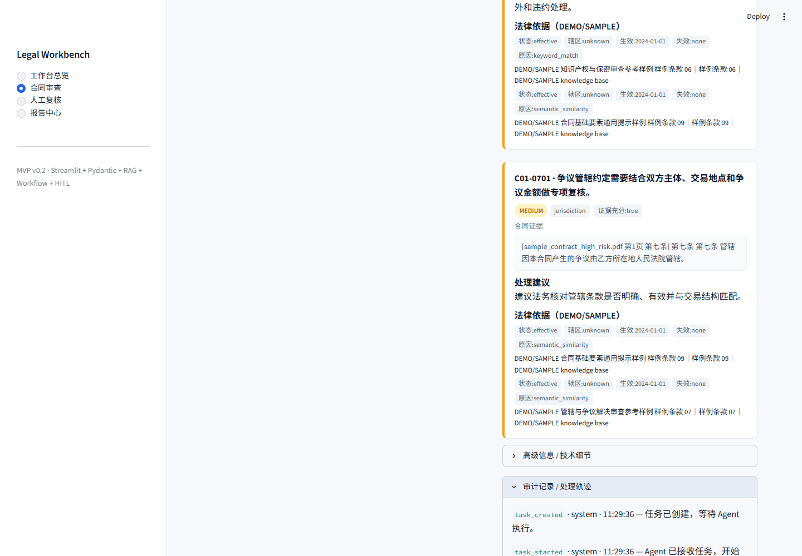

## Cinematic Review Experience

审查执行页使用四张已确认的品牌视觉资产，并由真实工作流状态驱动，而不是定时轮播：

| 视觉阶段 | 真实工作流状态 | 产品含义 |
| --- | --- | --- |
| Stage 1 | `received`、`parsing` | 合同接收与结构解析 |
| Stage 2 | `planning`、`retrieving` | 审查规划与法规检索 |
| Stage 3 | `analyzing`、`validating` | 风险分析与结果校验 |
| Stage 4 | `reporting`、`completed` | 报告生成与审查完成 |

高风险、低置信度或证据不足任务会进入 `review_required`，停留在 Stage 3 并进入 Human-in-the-Loop 法务复核；只有真实报告分支才展示 Stage 4。细粒度 timeline、RAG 证据、风险路由和审计事件均保留，技术详情默认折叠。

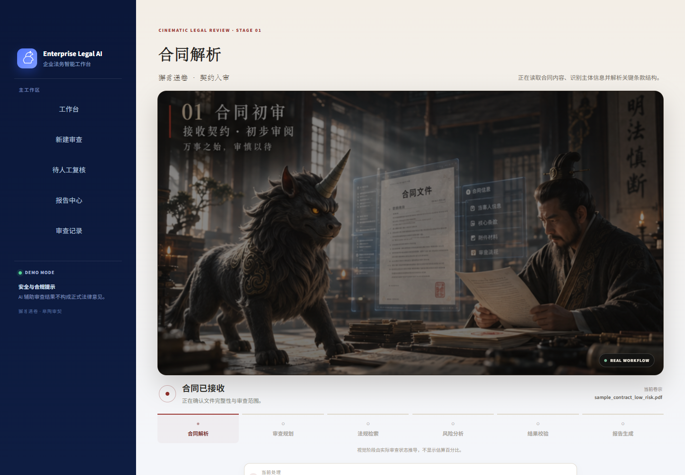
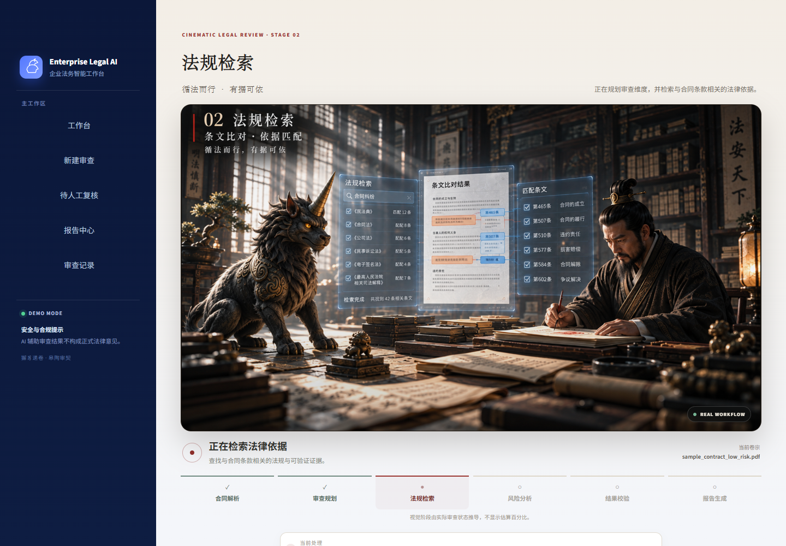
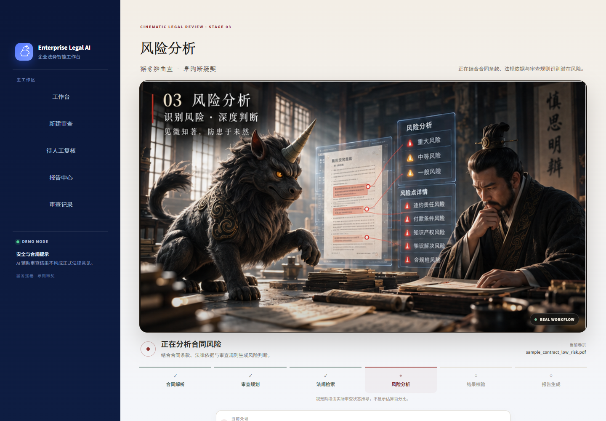
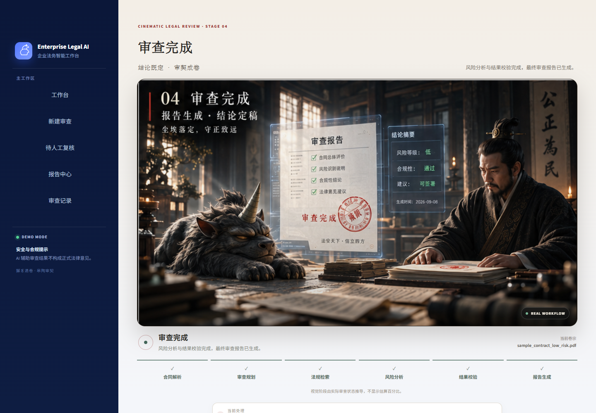

## 项目背景

企业合同审查存在高重复、高风险、证据链不透明的问题。纯聊天机器人虽然能生成解释，但不能稳定保证依据来源、输出结构、风险分流和责任边界。本项目将合同审查拆解成可运行、可测试、可解释的 AI Solution：用 RAG 提供证据，用 Pydantic 约束输出，用 Workflow 控制风险路由，用 Human Review 处理高风险和证据不足任务。

## 核心能力

- 合同上传与解析
- Chunk 切分与 metadata 保留
- Review Dimension Planner 审查维度识别
- Legal RAG metadata filtering
- Risk JSON / Pydantic Schema
- Workflow 风险分流
- Human-in-the-loop 人工复核
- Audit Log 审计留痕
- Report Generation 报告生成
- MCP Mock Adapter 企业集成预留
- DEMO MODE 无 API Key 可运行

## 技术架构

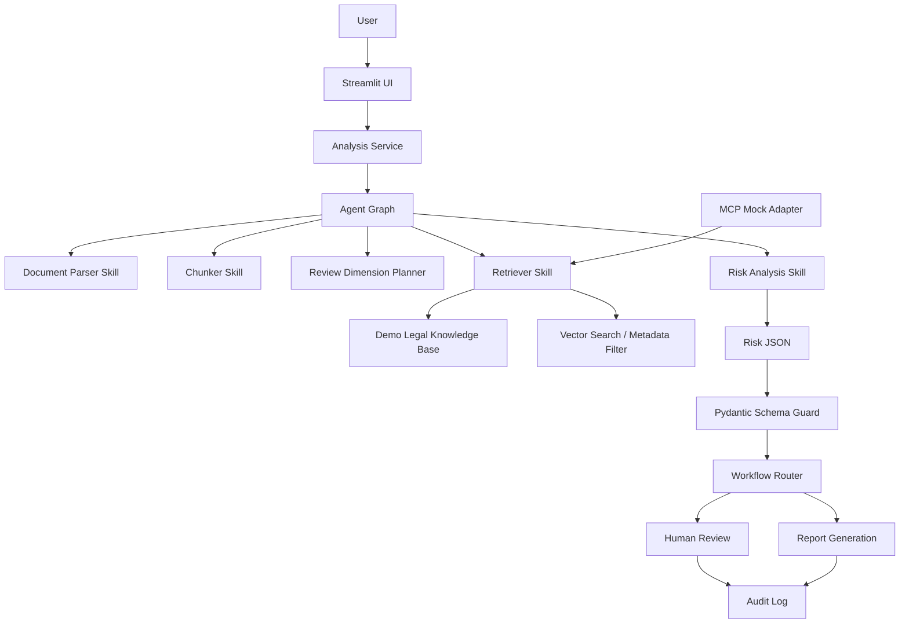

## 项目结构

```text
enterprise-legal-ai/
├─ app/
│  ├─ frontend.py                 # Streamlit Web UI
│  ├─ review_experience.py        # 工作流到四阶段视觉的映射与渲染
│  ├─ api.py                      # FastAPI service boundary
│  ├─ config.py                   # Settings / env
│  ├─ agent/                      # Agent state graph + review planner
│  ├─ schemas/                    # Pydantic Risk JSON / task / document / KB
│  ├─ skills/                     # parser, chunker, retrieval, risk, report
│  ├─ tools/                      # pdf, embeddings, vector search, KB, LLM client
│  ├─ workflow/                   # router + schema guard
│  ├─ services/                   # analysis service + task store
│  └─ mcp/                        # mock MCP adapter
├─ data/
│  ├─ contracts/                  # sample contracts
│  └─ legal_kb/                   # DEMO/SAMPLE legal knowledge base
├─ docs/                          # project documentation and screenshots
├─ app/static/review_stages/      # 四张最终审查阶段视觉资产
├─ scripts/                       # utility scripts and real LLM test
├─ tests/                         # unittest coverage
├─ README.md
├─ requirements.txt
├─ requirements-faiss.txt
├─ .env.example
├─ .gitignore
├─ Dockerfile
└─ LICENSE
```

## 快速启动

```bash
cd enterprise-legal-ai
python -m venv .venv

# Windows
.venv\Scripts\activate

# macOS/Linux
source .venv/bin/activate

pip install -r requirements.txt
streamlit run app/frontend.py
```

默认 Web App 端口：`8501`。  
浏览器访问 Streamlit 输出地址，通常是 `http://localhost:8501`。

## 运行测试

```bash
python -m unittest discover -s tests -v
```

当前测试覆盖：

- parser
- chunker
- schema
- workflow router
- review planner
- RAG metadata filter
- audit log
- MCP mock adapter
- empty retrieval
- demo end-to-end

## 环境变量

复制 `.env.example` 为 `.env`。不配置 API Key 时默认进入 DEMO MODE。

```dotenv
OPENAI_API_KEY=
OPENAI_BASE_URL=https://api.openai.com/v1
MODEL_NAME=gpt-4o-mini
EMBEDDING_MODEL=text-embedding-3-small
ENABLE_REAL_LLM=false
CONFIDENCE_THRESHOLD=0.75
MAX_UPLOAD_MB=10
LLM_TIMEOUT_SECONDS=30
```

| 变量 | 用途 |
| --- | --- |
| `OPENAI_API_KEY` | OpenAI-compatible API Key；留空进入 DEMO MODE |
| `OPENAI_BASE_URL` | OpenAI-compatible API 地址 |
| `MODEL_NAME` | 真实 LLM 模式使用的模型名 |
| `EMBEDDING_MODEL` | 预留 embedding 模型名，DEMO 默认本地哈希向量 |
| `ENABLE_REAL_LLM` | `true` + Key 才启用真实 LLM |
| `CONFIDENCE_THRESHOLD` | 低于该值必须人工复核 |
| `MAX_UPLOAD_MB` | 上传文件大小上限 |
| `LLM_TIMEOUT_SECONDS` | LLM HTTP 超时 |

不要把真实 API Key、Token、密码或 `.env` 提交到仓库。

## DEMO MODE

默认无 API Key 时进入 DEMO MODE：

- 内置规则引擎完整演示解析、切分、检索、Risk JSON、Workflow、复核和报告生成；
- 使用 `DEMO/SAMPLE` 示例合同和示例法规知识库；
- UI 始终提示 Demo 边界和法律免责声明；
- 上传文件也可以走主流程，仅风险分析在无 Key 时使用规则 / fallback 逻辑。

## API Boundary

项目包含 FastAPI service boundary，可用于未来前后端分离：

```bash
uvicorn app.api:app --host 0.0.0.0 --port 8000
```

| Method | Path | 用途 |
| --- | --- | --- |
| POST | `/api/analyze` | 上传文件 + question，创建分析任务 |
| GET | `/api/tasks/{task_id}` | 查询任务状态与结果 |
| POST | `/api/review/{task_id}` | 提交人工复核 decision + comment |
| GET | `/api/health` | 健康检查 |

## Real / Mock / Not Implemented 状态表

| 模块 | 状态 | 说明 |
| --- | --- | --- |
| Streamlit UI | REAL IMPLEMENTATION | 可运行工作台界面 |
| PDF parsing | REAL IMPLEMENTATION | PyMuPDF 优先、pypdf 兜底；支持 PDF/TXT/DOCX，OCR 未实现 |
| Chunking | REAL IMPLEMENTATION | 按条款、章节、段落切分并保留来源信息 |
| Metadata | REAL IMPLEMENTATION | 合同 chunk 和 KB 记录保留 source/page/section/status/domain 等字段 |
| RAG retrieval | REAL IMPLEMENTATION | 检索链路真实运行，底层知识库为 DEMO/SAMPLE |
| Vector store | REAL IMPLEMENTATION | 默认 numpy 余弦检索；安装可选依赖后可用 FAISS |
| Review Dimension Planner | REAL IMPLEMENTATION | 规则识别 9 类审查维度并写入任务与 Risk JSON |
| Agent orchestration | REAL IMPLEMENTATION | 显式状态图编排；未引入 LangGraph |
| Risk JSON validation | REAL IMPLEMENTATION | Pydantic 校验，schema 错误可修复一次 |
| Workflow routing | REAL IMPLEMENTATION | 按风险、置信度、证据充分性、法规状态路由 |
| Human Review | REAL IMPLEMENTATION | 复核队列、人工修改、decision/comment、reviewed 状态 |
| Audit Log | REAL IMPLEMENTATION | 记录任务创建、解析、检索、分析、路由、复核、报告 |
| Report generation | REAL IMPLEMENTATION | 生成 Markdown 报告并支持下载 |
| Real LLM call | REAL IMPLEMENTATION | OpenAI-compatible 客户端与测试脚本存在；需用户配置 Key |
| MCP adapter | MOCK IMPLEMENTATION | mock adapter 演示未来企业工具/资源连接方式 |
| External legal website integration | NOT IMPLEMENTED | 未接真实外部法律网站或正式法规源 |
| User auth | NOT IMPLEMENTED | 无登录、RBAC、ABAC 或租户隔离 |
| Database persistence | NOT IMPLEMENTED | 当前使用本地 JSON Task Store，不是生产数据库 |
| Deployment | MOCK IMPLEMENTATION | Dockerfile 存在；未提供生产云部署流水线 |

## 项目边界

- 本项目是作品集 MVP，不构成正式法律意见。
- Demo 法规数据仅用于演示，不是真实法律数据库。
- MCP 当前为 mock implementation，不代表已经接入外部法规源。
- 真实生产环境需要法规库治理、权限体系、审计持久化、人工审核流程和企业系统集成。
- 当前没有 OCR、批量任务、SSO/RBAC、多租户、监控告警和生产部署流水线。

## 项目文档

- [一页纸项目说明](docs/ONE_PAGE_PROJECT_BRIEF.md)
- [SDD 开发过程](docs/SDD_PROCESS.md)
- [项目复盘](docs/PROJECT_RETROSPECTIVE.md)
- [Roadmap](docs/ROADMAP.md)

## Roadmap

详见 [docs/ROADMAP.md](docs/ROADMAP.md)。

简要方向：

- V1：当前作品集 MVP
- V2：React/Next.js + FastAPI + PostgreSQL/pgvector 的企业试点原型
- V3：SSO/RBAC、真实 MCP Server、法规治理、监控、模型评估和审计回放的生产级平台
