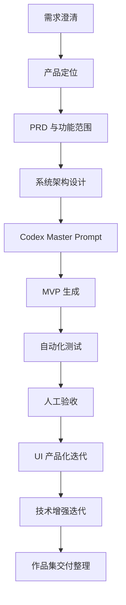

# SDD Process — 本项目的规范驱动开发过程

## 什么是本项目中的 SDD

SDD 指 Spec Driven Development，即规范驱动开发。本项目不是直接让 AI Coding 工具凭感觉生成页面，而是先明确业务场景、用户、流程、数据结构、AI 架构、风险边界和验收标准，再通过 Codex 辅助实现、测试和迭代。

## SDD 流程图

## 阶段一：需求澄清

先确定项目不是做泛泛的 AI 聊天工具，而是面向企业法务和合规团队，解决合同审查中的条款解析、法规依据检索、风险识别、人工复核和审计留痕问题。

## 阶段二：产品定位

项目定位为“企业法务 AI 合同审查工作台 MVP”。目标是展示 AI Solution 能力，而不是交付生产级法律意见系统。

## 阶段三：PRD 与功能范围

PRD 明确了核心功能：合同上传、问题输入、示例合同、合同解析、Chunk 切分、RAG 检索、Risk JSON、Workflow 分流、Human Review、报告下载、Demo Mode 和免责声明。

## 阶段四：系统架构设计

架构拆分为 UI 层、Service Layer、Agent Orchestration、Skills/Tools、RAG、Pydantic Schema、Workflow Router、Task Store、Human Review 和 MCP Mock Adapter。

## 阶段五：Codex Master Prompt

使用完整的 Codex Master Prompt 驱动项目生成，而不是零散让 AI 写代码。Prompt 中定义了技术栈、项目目录、核心流程、测试要求、验收标准和 Real / Mock 边界。

## 阶段六：MVP 生成

Codex 根据规范生成可运行项目，包含 Streamlit UI、后端分析服务、Agent 状态图、Skills、Tools、Workflow、Schemas、Demo 数据和测试。

## 阶段七：自动化测试

通过 unittest 覆盖 parser、chunker、schema、workflow、empty retrieval、demo e2e、review planner、metadata filter、audit log 和 MCP mock adapter，避免项目只停留在页面展示。

## 阶段八：UI 产品化迭代

第一版界面偏工程 Demo，因此进行了企业级工作台化改造，增加 Dashboard、合同审查页、结果页、人工复核队列、报告中心和高级技术细节区。

## 阶段九：技术增强迭代

补充 Review Dimension Planner、Legal RAG metadata filter、Workflow evidence 路由、Human Review audit log、真实 LLM 测试脚本和 MCP mock adapter 增强。

## 阶段十：作品集交付整理

最后整理 GitHub README、一页纸说明、面试讲解稿、关键代码截图指南、复盘文档和 Roadmap，使项目适合投递、展示和面试讲解。

## 项目体现的 SDD 能力

- 能先做需求澄清和产品定义，而不是直接写代码。
- 能把业务问题转化为系统流程、数据结构和验收标准。
- 能用 AI Coding 工具生成 MVP，同时保留人工判断和测试验收。
- 能明确 Real / Mock / Not Implemented 边界，不夸大 Demo 能力。
- 能通过迭代把工程 Demo 打磨成可展示的作品集项目。
